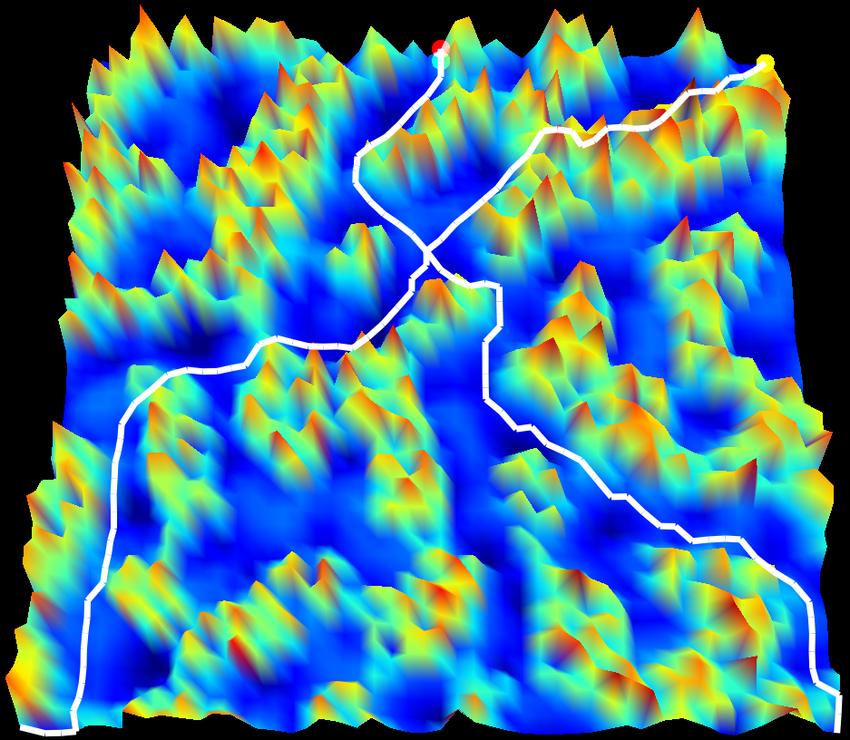

# Multi Agent Path Finding Visualization

**This is a multi-agent path finding visualization that works with 3D elevation maps**
-  Implements cooperative A* MAPF algorithm in 3 dimensions
  - http://www0.cs.ucl.ac.uk/staff/D.Silver/web/Applications_files/coop-path-AIIDE.pdf
-  Leverages open simplex noise to generate realistic elevation maps
   - Supports the creation of four different biomes: plains, mountains, canyons, and all three combined
- Visualization built using PyQtGraph and OpenGL

Here's what it looks like! 
  

## Usage
This visualization runs on Python 3.7

Start off by cloning the repo:  
`git clone https://github.com/danielzgsilva/MultiAgentPathFinding`

Navigate to the project's root and install dependencies like so:  
`pip install -r requirements.txt`

Available commands are:
- --num_agents | number of agents to spawn into the world | REQUIRED
- --starts | list of x, y start coordinates for each agent | REQUIRED
- --goals | list of x, y goal coordinates for each agent | REQUIRED
- --max_time | maximum amount of time steps each agent has to each its goal | REQUIRED
- --width | width of the grid
- --height | height of the grid
- --map_type | type of map to create (plains, mountains, canyons, default - combined)
- --no_viz | if set, the visualization will not run, only a list of paths will be returned
                 
Run the visualization like so:  
`python run.py --num_agents 2 --starts 0,0 5,5 --goals 49,49 45,45 --max_time 30`

## Work in progress:
- Creating PyQt GUI
- Cooperative A* algorithm runtime improvements
- Scheduling agents between multiple goals
- Implementing Windowed Hierarchical Cooperative A* 
